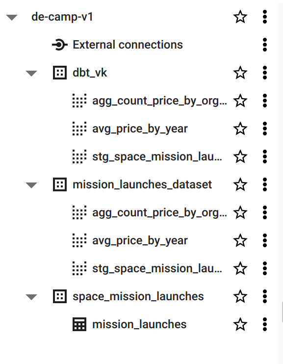
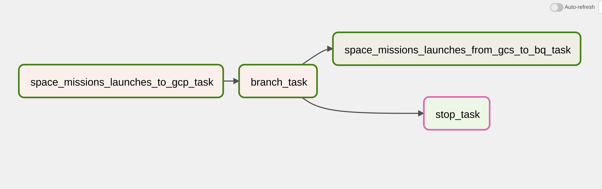

## Project description.

This project represents data from dataset with space mission launches from kaggle.
To make things easier to reproduce dataset was temporary moved to personal bucket 
https://storage.cloud.google.com/dataset_source_bucket/.

What is done:
1. As a IaC tool terraform was used. 
   It creates bucket in GCS that is used as data lake 
   and datasets in BigQuery that is used as DWH.
2. As a workflow or orchestration Airflow runs dag 
   `space_mission_launches_to_gcp_dag` that executes two tasks :
   
   First task gets data from dataset source bucket, unzip it, makes transformations
   and loads new data to datalake.
   Second task loads data from data lake to DWH BigQuery.
3. Based on BigQuery dataset dbt models are build. 
   Staging model describe dataset from DWH and aggregated models contain 
   mission launches data aggregated by organisations, statuses and years.
4. As a result data is represented in report in google looker studio.
   It is available by link https://lookerstudio.google.com/reporting/123d769c-1bd2-4d3c-a07d-dfc7e2a4110f

To run locally:
1. Create env by running:

        pyenv install 3.10.6
        poetry use env 3.10.6
        poetry install
2. Provide your GCP credentials by adding in project folder `credentials/<your_credentials_json_filename>`
3. Update in terraform `main.tf` and `variables.tf` credentials and other GCP info 
   like bucket and dataset names etc. Then run in terraform directory:
       
       terraform init 
       terraform apply
4. Up airflow container by running in airflow directory command:

       docker compose up --build
   Now you can find airflow UI on http://localhost:8080/, by default login and password are `airflow`.
   Add in admin -> connections connection with name `google_cloud_default`
   Run `space_mission_launches_to_gcp_dag` to load data in your bucket.
5. To run dbt locally move `profiles.yml` to /home/<user_name>/.dbt.
   Update profile and provide credentials. Run:
       
       dbt run
       dbt test
   You can also set up dbt cloud to develop project there. You`ll need to register account and follow steps in dbt guid.

   
